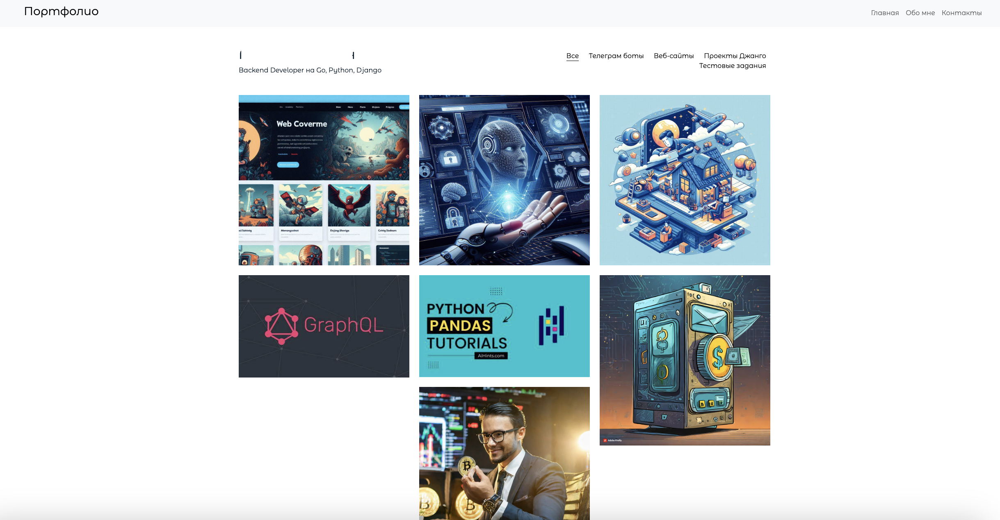

# Portfolio Django



Проект "Portfolio Django" представляет собой портфолио Backend Developer'a, который специализируется на разработке с использованием Go, Python и фреймворка Django.

## Установка

Для установки проекта выполните следующие шаги:

1. Склонируйте репозиторий:

    ```
    git clone https://github.com/your_username/portfolio_django.git
    ```

2. Перейдите в каталог с проектом:

    ```
    cd portfolio_django
    ```

3. Создайте и активируйте виртуальное окружение:

    ```
    python -m venv venv
    source venv/bin/activate  # Для Linux/MacOS
    # или
    venv\Scripts\activate  # Для Windows
    ```

4. Установите зависимости:

    ```
    pip install -r requirements.txt
    ```

## Запуск

Для запуска проекта выполните следующие шаги:

1. Перейдите в каталог с проектом (если ещё не находитесь там):

    ```
    cd portfolio_django
    ```

2. Запустите миграции:

    ```
    python manage.py migrate
    ```

3. Запустите локальный сервер:

    ```
    python manage.py runserver
    ```

## Структура проекта

В проекте "Portfolio Django" используется следующая структура:

- **portfolio_django/**: Корневой каталог проекта.
- **portfolio/**: Приложение для отображения портфолио.
- **static/**: Каталог для статических файлов (CSS, JavaScript и т.д.).
- **templates/**: Каталог для шаблонов HTML.
- **manage.py**: Скрипт для управления проектом Django.

## Дополнительная информация

Для дополнительной информации свяжитесь с разработчиком по адресу a-dauren@bk.ru

Thanks !